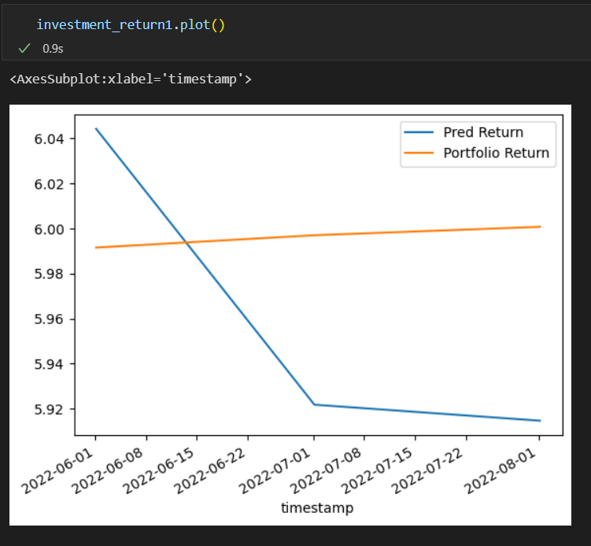
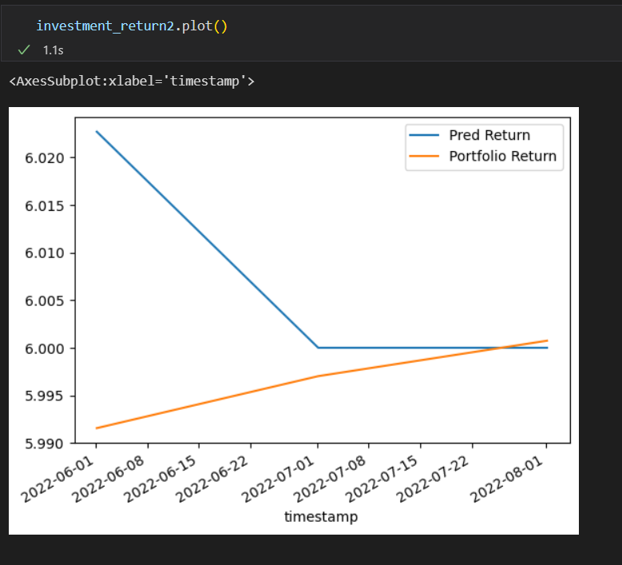

# Analysis of Optimal Investment Portfolio 

The goal of this project is to develop a machine learning model which can be used to help us form the best investment portfolio of the selected stocks to generate the maximum returns.
## Background 
The implementation of machine learning models and algorithmic trading in the financial industry has enabled traders to make faster, more time-efficient transactions with minial human errors. The supervised learning model we chose is not only able to perform more efficiently than human traders, it is able to simplify data based on historical returns, train the model and calculate the predicted output.
## FinTech Techniques Used 
- Aim: Predict the monthly returns of the investment portfolio of 6 chosen stocks, then compare them against the actual portfolio return.

We applied two new models that are not taught in class to build our programs.
- Main model - Support Vector Regression (SVR)
- Backtest model - K Nearest Neighbors Regression (KNN)
When applying the models, there are also a few new libraires used, including svm and KNeighborsRegressor.
## Model Evaluation
- Method:
We validate the performance of our model in two ways - hold-out validation through splitting data into training and testing sets and back testing using a second model.
- Process: 
We fitted the training data into StandardScaler model, then used the trained data as the input to the SVM model to predict expected returns. Followingly, we applied the KNeigborsRegressor model to the same set of data to produce the expected returns.
## Model Tuning
As you may know, varying the investment portfolios could potentially change the result of the prediction model. Thus, to modify our models, we applied several methods, such as adjusting the simple-moving average of investment portfolios, changing the time window and changing the number of shares boughts.

## Results
- Prediction by SVR model
(Please note that values are very close and that is why the result may seem very different.)

- Prediction by KNN model

Conclusion: The K Nearest Neighbors Regression model produces better result for predicting continuous data.
## Postmortem 
- The first dififculty we encoutered was obtaining stock data using Alpaca API, including issues like expiring secret keys, wrong ticker names and having trouble setting up aplaca api correctly.
- The second problem we had was the conflict between the type of data and the machine learning model. Initially, we selected Support Vector Classifier (SVC) as the model for testing and training continuous stock returns, which proved to be incompatible as SVC could only be applied to categorical data. We solved this problem by switching to another model called Support Vector Regression (SVR).
- When backtesting with a secondary model, we encountered another conflict between data and model - the Logistic Regression model we intended to use for backtesting was also not applicable for continuous data. Similarly, we solved this issue by changing to using the K Nearest Neighbor Regression (KNN) model to analyse continuous data.
## Data Sources
 - Alpaca trade API
 - Nasdaq API 
 - Yahoo Finance
